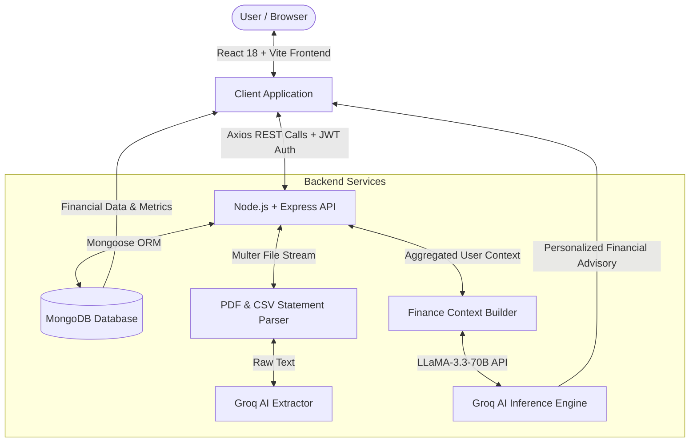

# 🚀 FinGenius — AI-Powered Personal & Family Financial Assistant

<p align="center">
  
</p>

<p align="center">
  <b>An Intelligent, Full-Stack Personal & Family Financial Management Suite Powered by AI</b>
</p>

<p align="center">
  
  
  
  
  
  
</p>

---

## ✍️ Project Creator & Developer
> **This project is proudly designed, architected, and created by Harsh Kumar.**
> 
> *FinGenius was built to transform complex personal financial data into actionable, automated AI insights, empowering individuals and families to achieve financial freedom.*

---

## 📌 Table of Contents
1. [Overview & Use Case](#-overview--use-case)
2. [What is Included in This Project](#-what-is-included-in-this-project)
3. [Key Features & Modules](#-key-features--modules)
4. [Project Workflow & Architecture](#-project-workflow--architecture)
5. [Tech Stack](#-tech-stack)
6. [Prerequisites](#-prerequisites)
7. [Environment Configuration](#-environment-configuration)
8. [How to Run the Project](#-how-to-run-the-project)
9. [API Routes Documentation](#-api-routes-documentation)
10. [Author Credit](#-author-credit)

---

## 💡 Overview & Use Case

### What is FinGenius?
**FinGenius** is an all-in-one financial intelligence platform designed to eliminate financial stress by providing automated expense tracking, smart budget allocation, bank statement parsing, investment portfolio management, family financial collaboration, and an interactive AI financial assistant.

### Why FinGenius? (The Problem It Solves)
* **Scattered Financial Data:** Most people use separate tools for budget tracking, bank statement analysis, credit card monitoring, and goal tracking. FinGenius unifies all of them in a single dashboard.
* **Manual Entry Fatigue:** Traditional expense apps require tedious manual logging. FinGenius features an **AI Bank Statement Parser** that automatically reads PDF and CSV bank statements and extracts/categorizes transactions in seconds.
* **Lack of Personalized Financial Guidance:** FinGenius incorporates **GeniusAI Assistant** (powered by Groq `llama-3.3-70b-versatile`) which analyzes your live financial context (income, savings, debt, goals, investments) to offer tailored financial advice.
* **No Family Financial Visibility:** Managing shared household expenses can be messy. The **Family Circle** feature allows families to track joint expenses, share budgets, and achieve group financial milestones together.

---

## 📦 What is Included in This Project

FinGenius is structured as a **Monorepo Workspace** comprising a high-performance React TypeScript frontend and a scalable Node.js Express backend.

```
FinGenius/
├── package.json                   # Root monorepo workspace configuration & runner scripts
├── README.md                      # Complete project documentation & setup guide
│
├── frontend/                      # React 18 + TypeScript + Vite Client
│   ├── public/                    # Static assets & app favicon/logo
│   └── src/
│       ├── components/            # Reusable UI components & Layouts
│       │   ├── DashboardLayout.tsx# Main authenticated dashboard sidebar & layout
│       │   ├── FloatingAIChat.tsx # Persistent floating AI chat widget
│       │   ├── Footer.tsx         # Responsive footer with Harsh Kumar creator branding
│       │   ├── Navbar.tsx         # Public landing page navigation header
│       │   ├── PrivateRoute.tsx   # Auth guard wrapper for protected pages
│       │   └── ui/                # Base UI elements (buttons, inputs, cards, dialogs)
│       ├── pages/                 # 16 Full feature pages
│       │   ├── Home.tsx           # High-converting landing page
│       │   ├── Login.tsx          # User sign-in page
│       │   ├── SignUp.tsx         # User registration page
│       │   ├── OverviewPage.tsx   # Financial dashboard overview & analytics
│       │   ├── AIAssistantPage.tsx# Full-screen GeniusAI conversational workspace
│       │   ├── Rule503020Page.tsx # 50/30/20 budgeting rule analysis & allocation
│       │   ├── BankAnalysisPage.tsx# PDF/CSV bank statement upload & AI parser
│       │   ├── FamilyCirclePage.tsx# Shared family group financial tracking
│       │   ├── InvestmentsPage.tsx# Portfolio & asset management (Stocks, MFs, Crypto)
│       │   ├── SubscriptionsPage.tsx# Recurring subscriptions & credit cards tracker
│       │   ├── ExpensesPage.tsx   # Income & expense ledger with filtering & export
│       │   ├── GoalsPage.tsx      # Target savings goals & deadline calculator
│       │   ├── AlertsPage.tsx     # Custom financial alerts & AI warnings
│       │   ├── SettingsPage.tsx   # User profile, theme settings & preferences
│       │   └── ForgotPasswordPage.tsx# Password reset utility
│       ├── services/
│       │   └── api.ts             # Axios HTTP client connecting to Express APIs
│       └── utils/                 # Utility functions & helpers
│
└── backend/                       # Node.js + Express + MongoDB REST API Server
    └── src/
        ├── middleware/
        │   └── auth.js            # JWT verification & authorization middleware
        ├── models/                # 10 Mongoose Schemas
        │   ├── User.js            # User accounts & settings schema
        │   ├── Transaction.js     # Expense & income transaction schema
        │   ├── Goal.js            # Financial goals & savings trajectory schema
        │   ├── Alert.js           # Smart notification & budget limit alert schema
        │   ├── BankStatement.js   # Uploaded statement audit & transaction schema
        │   ├── Circle.js          # Family Circle group financial schema
        │   ├── Investment.js      # Investment portfolio asset schema
        │   ├── Subscription.js    # Recurring subscriptions & cards schema
        │   ├── CreditCard.js      # Credit card limits & statement schema
        │   └── ChatMessage.js     # GeniusAI conversational history schema
        ├── routes/                # 10 Express API Controller Routes
        │   ├── auth.js            # Register, Login, Profile & Password Reset
        │   ├── transactions.js    # Transaction CRUD, summary & categorization
        │   ├── goals.js           # Savings goals tracking & contributions
        │   ├── alerts.js          # Automated alert generation & management
        │   ├── bankStatements.js  # File upload, PDF/CSV parsing & AI classification
        │   ├── circles.js         # Group circle creation, invite & expense sharing
        │   ├── investments.js     # Asset tracking, gain/loss calculation
        │   ├── rule503020.js      # Dynamic 50/30/20 budget breakdown engine
        │   ├── subscriptions.js    # Recurring billing & renewal notifications
        │   └── ai.js              # GeniusAI advisor powered by Groq AI API
        ├── utils/                 # Backend helpers & AI integration modules
        │   ├── groqClient.js      # Groq AI LLaMA 3.3 model integration
        │   ├── financeContext.js  # User financial state aggregator for AI
        │   ├── statementParser.js # PDF & CSV raw text parser
        │   └── statementAI.js     # LLM transaction extraction & classification engine
        └── server.js              # Server entry point, MongoDB connection & CORS setup
```

---

## 🔥 Key Features & Modules

### 1. 🤖 GeniusAI Financial Assistant
* Built-in conversational AI chatbot powered by **Groq LLaMA 3.3 70B Versatile**.
* Context-aware: Reads live transactions, active budget allocations, savings goals, and investment returns before crafting advice.
* Available both as a dedicated page (`/dashboard/ai-assistant`) and a floating widget accessible anywhere in the dashboard.

### 2. 📊 50/30/20 Budgeting Engine
* Automatically divides total monthly income into:
  * **50% Needs**: Essential expenses (rent, groceries, utilities).
  * **30% Wants**: Lifestyle & luxury spending (entertainment, dining out).
  * **20% Savings & Debt**: Investments, emergency funds, loan payoffs.
* Provides real-time visual progress bars, over-spending alerts, and actionable recommendations to align spending with healthy financial principles.

### 3. 📄 AI Bank Statement Parser (PDF & CSV)
* Drag & drop bank statements in PDF or CSV formats.
* Uses **`pdf-parse`** and **`csv-parse`** to extract statement text, then feeds data into Groq AI for intelligent categorization (Merchant, Amount, Category, Date, Income/Expense flag).
* Auto-saves extracted transactions directly into your expense ledger.

### 4. 👨‍👩‍👧‍👦 Family Circle (Shared Household Finances)
* Create or join family circles to track collective household expenses.
* View total family budget, individual contributions, split shared bills, and track joint savings goals (e.g., family vacation, home purchase).

### 5. 📈 Investment Portfolio Tracker
* Track stocks, mutual funds, crypto assets, fixed deposits, and real estate.
* Calculates total portfolio value, invested amount, net returns, and percentage returns.
* Asset allocation charts for portfolio diversification inspection.

### 6. 💳 Subscriptions & Credit Card Manager
* Keep track of active monthly/annual subscriptions (Netflix, Spotify, AWS, Gym).
* Tracks credit card billing cycles, credit limits, interest rates, and upcoming due dates.
* Prevents unwanted auto-renewals by alerting users prior to renewal dates.

### 7. 🎯 Financial Goals Engine
* Define short-term and long-term financial milestones (e.g., Emergency Fund, Car Purchase).
* Input target amount, target date, and initial savings.
* Visual trajectory charts, remaining days countdown, and calculated required monthly savings.

### 8. 💸 Expense & Income Ledger
* Record detailed transactions with categories (Food, Shopping, Salary, Bills, etc.).
* Instant search, category filtering, and date range selection.
* One-click PDF report generation and CSV export capabilities.

### 9. 🔔 Smart Alerts & Notifications
* System-generated warnings when spending exceeds set budget thresholds.
* Bill due date reminders and low balance warnings.
* AI-driven spending anomaly detection (flagging unusually high spending in a category).

### 10. 🌗 Responsive Dark/Light UI & Footer Branding
* Toggle between dark mode and light mode instantly with preference persistence.
* Displays custom footer credit across all pages and layouts: **"Written & Created by Harsh Kumar"**.

---

## ⚙️ Project Workflow & Architecture



### End-to-End Execution Flow
1. **User Authentication:** User registers or signs in via `/api/auth/login`. Server generates a signed JWT token stored securely in localStorage.
2. **Dashboard Initialization:** Protected routes request user transactions, goals, investments, and subscriptions using authorized API calls.
3. **Statement Parsing Workflow:**
   - User uploads a bank statement PDF/CSV on `/dashboard/bank-analysis`.
   - Express server intercepts the upload via `multer`.
   - `pdf-parse` / `csv-parse` extracts raw text content.
   - Groq AI processes the raw text into structured JSON transaction objects.
   - JSON data is persisted to MongoDB and reflected instantly on the UI.
4. **GeniusAI Advisory Flow:**
   - User types a query into GeniusAI Chat.
   - `financeContext.js` fetches the user's latest income, expenses, active goals, and investments from MongoDB.
   - The aggregated context is sent alongside the prompt to Groq AI (`llama-3.3-70b-versatile`).
   - GeniusAI replies with accurate, customized financial recommendations.

---

## 🛠 Tech Stack

### Frontend
* **Core Framework:** React 18 (TypeScript)
* **Build Tool:** Vite
* **Styling & UI:** Tailwind CSS, PostCSS, Autoprefixer
* **UI Components:** Radix UI primitives (`dialog`, `tabs`, `dropdown-menu`, `select`, `accordion`)
* **Icons:** Lucide React
* **Data Visualization:** Chart.js, React-ChartJS-2, Recharts
* **State & Data Fetching:** TanStack React Query v5, Axios
* **Form Handling:** React Hook Form + Zod validation
* **Notifications:** Sonner Toasts
* **PDF Export:** jsPDF + jsPDF-AutoTable

### Backend
* **Runtime:** Node.js (ES Modules)
* **Framework:** Express.js
* **Database:** MongoDB
* **Database Modeling:** Mongoose ORM
* **Authentication:** JSON Web Tokens (jsonwebtoken), BcryptJS password hashing
* **File Upload & Parsing:** Multer, pdf-parse, csv-parse
* **Cross-Origin Handling:** Cors
* **Environment Management:** Dotenv

### AI / LLM Engine
* **AI Provider:** Groq Cloud API
* **Model:** `llama-3.3-70b-versatile`
* **Custom AI Logic:** Automated context aggregation, prompt engineering for financial advisory, transaction extraction from unstructured bank statements.

---

## 📋 Prerequisites

Before running this project locally, ensure you have the following installed:
* **Node.js**: v18.0.0 or higher
* **npm**: v9.0.0 or higher
* **MongoDB**: A running local MongoDB instance (`mongodb://localhost:27017`) OR a MongoDB Atlas cluster URI.
* **Groq API Key**: (Optional for AI features, grab a free key from [Groq Console](https://console.groq.com/)).

---

## 🔑 Environment Configuration

### 1. Backend Environment Setup (`backend/.env`)
Create a `.env` file inside the `backend/` directory with the following variables:

```env
PORT=5001
MONGODB_URI=mongodb://localhost:27017/fingenius
JWT_SECRET=fingenius_super_secret_jwt_key_2026
CORS_ORIGIN=http://localhost:5173
GROQ_API_KEY=your_groq_api_key_here
```

*(A template is also available at `backend/.env.example`)*

### 2. Frontend Environment Setup (`frontend/.env`)
Create a `.env` file inside the `frontend/` directory with the following variable:

```env
VITE_API_URL=http://localhost:5001/api
```

---

## 🚀 How to Run the Project

FinGenius is configured with workspace scripts so you can install and run both frontend and backend seamlessly from the root folder.

### Step 1: Clone the Repository
```bash
git clone https://github.com/HarshKumar/FinGenius.git
cd FinGenius
```

### Step 2: Install All Dependencies
Run the workspace installer script from the root directory to install dependencies for both `frontend` and `backend`:
```bash
npm run install:all
```
*(Alternatively, you can run `npm install` inside both `frontend` and `backend` directories).*

### Step 3: Run the Project in Development Mode
To start both the Backend server (Port 5001) and Frontend Vite server (Port 5173) concurrently:
```bash
npm run dev
```

### Accessing the Web Application
Once launched, open your web browser and navigate to:
👉 **`http://localhost:5173`**

---

## 📡 API Routes Documentation

| HTTP Method | Endpoint | Description | Auth Required |
| :--- | :--- | :--- | :---: |
| **POST** | `/api/auth/register` | Create a new user account | ❌ No |
| **POST** | `/api/auth/login` | Authenticate user & receive JWT | ❌ No |
| **GET** | `/api/auth/me` | Fetch authenticated user profile | ✅ Yes |
| **PUT** | `/api/auth/settings` | Update user theme & notifications | ✅ Yes |
| **POST** | `/api/auth/reset-password` | Reset forgotten password | ❌ No |
| **GET** | `/api/transactions` | Fetch all user transactions | ✅ Yes |
| **POST** | `/api/transactions` | Log a new income/expense transaction | ✅ Yes |
| **DELETE** | `/api/transactions/:id` | Delete a transaction | ✅ Yes |
| **GET** | `/api/rule503020` | Get 50/30/20 budget analysis & AI feedback | ✅ Yes |
| **POST** | `/api/bank-statements/upload` | Upload & parse PDF/CSV bank statement | ✅ Yes |
| **GET** | `/api/circles` | Fetch family circles & group expenses | ✅ Yes |
| **POST** | `/api/circles` | Create a new family circle | ✅ Yes |
| **GET** | `/api/investments` | Fetch investment portfolio & returns | ✅ Yes |
| **POST** | `/api/investments` | Add new investment asset | ✅ Yes |
| **GET** | `/api/subscriptions` | Fetch recurring subscriptions & credit cards | ✅ Yes |
| **POST** | `/api/subscriptions` | Add subscription or credit card | ✅ Yes |
| **GET** | `/api/goals` | Fetch financial goals & progress | ✅ Yes |
| **POST** | `/api/goals` | Create a new financial goal | ✅ Yes |
| **GET** | `/api/alerts` | Fetch alerts & notification settings | ✅ Yes |
| **POST** | `/api/ai/chat` | Send message to GeniusAI Assistant | ✅ Yes |

---

## 👤 Author Credit

This application was conceptualized, designed, and built from scratch by **Harsh Kumar**.

* **Project Developer:** Harsh Kumar
* **Project Name:** FinGenius — AI Financial Management Suite
* **License:** MIT License

<p align="center">
  <b>Designed & Created with ❤️ by Harsh Kumar</b>
</p>
